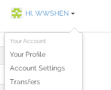
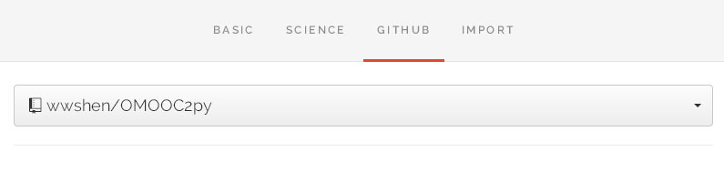

[发布作业1-OMOOC2py@issue5](https://github.com/OpenMindClub/OMOOC2py/issues/5)

#创建gitbook电子书并与github联动
##设置gitbook账户    
    网址:https://www.gitbook.com/
    使用github账户登录。
    在右上角的账户名边，点开“account settings”，设置邮箱和密码。
    如图所示:
    查看Github，状态是：Added. 
    点开reconncet GitHub Account，增加gitbook账户的权限：除了登入账户以外，还可以登入公共仓库。

##创建新书
    设置新书地址设为https://wwshen.gitbooks.io/OMOOC2py
    点开上方的github按钮，选择库到之前设立的公共库wwshen/LPython
    
    创建新书成功。

#配置DISQUS插件
    在gitbook帮助文档中找到plugins
    帮助文档提供插件链接：plugins.gitbook.com.
    点击链接，搜索DISQUS，找到相应插件。
    注册DISQUS，设置shortname
    打开新开的书本，在右上角设置在找到plugin，并点击，在files tree中出现book.json。
    在book.json中输入如下内容。
    

#重要参考
[gitbook参考文档](https://help.gitbook.com/)