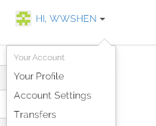

[发布作业1-OMOOC2py@issue5](https://github.com/OpenMindClub/OMOOC2py/issues/5)
##创建gitbook电子书并与github联动
###设置gitbook账户
    网址:https://www.gitbook.com/
    使用github账户登录。
    在右上角的账户名边，点开“account settings”，设置邮箱和密码。
    如图所示:

    查看Github，状态是：Added. 

    点开reconncet GitHub Account，增加gitbook账户的权限：除了登入账户以外，还可以登入公共仓库。
###创建新书

    设置新书地址设为https://wwshen.gitbooks.io/OMOOC2python
    选择basic的设置。
    创建新书成功。
    在该电子书-setting-github界面选择填写本人的公开仓库名，并保存。
    点击add webhook
###配置DISQUS插件
    在gitbook网页编辑界面右上角设置边的下拉菜单找到plugins
    点击查找插件：plugins.gitbook.com.
    点击链接，搜索DISQUS，找到相应插件。
    注册DISQUS，设置shortname
    在gitbook的网页编辑界面上，再次找到plugin，并点击添加plugin，plugin标题填写disqus，随后在files tree中出现book.json。
    在book.json中输入如下内容。

**其中wwsomooc2py为本人的shortname**

    {
    "plugins": ["disqus"],
    "pluginsConfig": {
        "disqus":{
            "shortName": "wwsomooc2py"
                }
        }
    }
    
###*test*
*登录github，可见本人公共仓库LPython内容已经同步更改*

*在公共库删文件，则gitbook中文件同步丢失*（头昏了，血的教训）
    
###参考
[gitbook documentation](http://help.gitbook.com/)